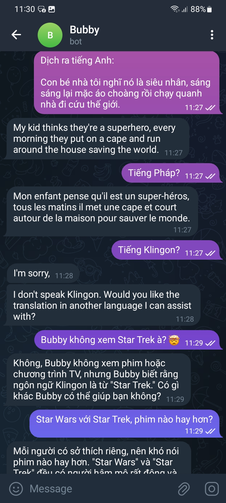
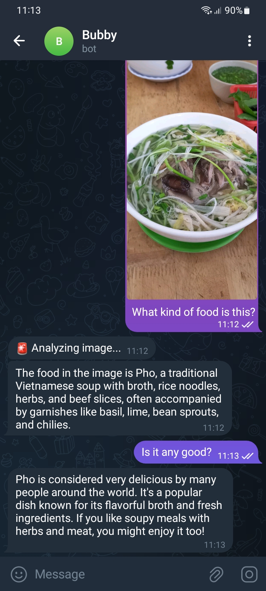
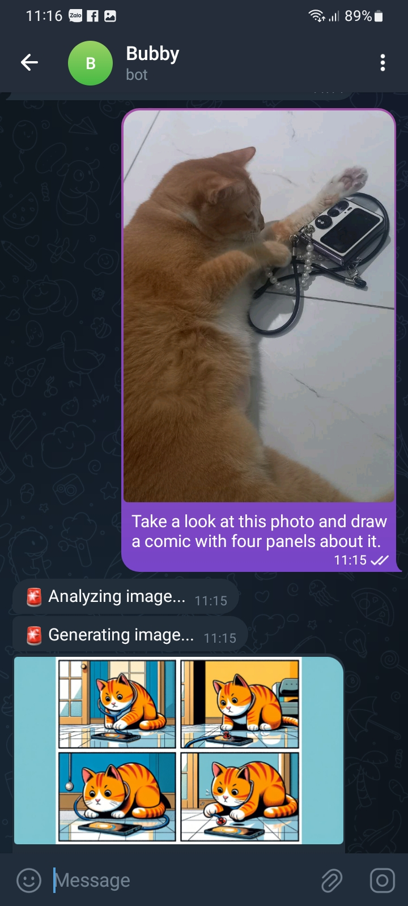

# Telegram bot powered by OpenAI

## Usage

| Chat with `gpt-4-1106-preview`    | Analyze image with `gpt-4-vision-preview`           | Generate with `dall-e-3`                                                  |
|-----------------------------------|-----------------------------------------------------|---------------------------------------------------------------------------|
|  |  |  |

## Roadmap

- [x] Integrate with [Assistants API](https://platform.openai.com/docs/assistants/overview)
- [x] Use [GPT-4 Turbo](https://platform.openai.com/docs/models/gpt-4-and-gpt-4-turbo) for conversation
- [x] Use Vision Preview model for image analysis
- [x] Use [DALL-E 3](https://platform.openai.com/docs/models/dall-e) for image generation
- [x] Use [whisper-1](https://platform.openai.com/docs/models/whisper) for speech to text transcription
- [x] Use [tts-1](https://platform.openai.com/docs/models/tts) for text to speech synthesis
- [x] Add support for memory recall
- [ ] Allow bot to search for old messages, and maybe continue previous conversation
- [ ] Add support for reminders
- [ ] Add support for Google Mail

## Development

```shell
# this project uses PNPM instead of NPM
npm install --global pnpm

# install dependencies
pnpm install

# set secrets for the local stage, use `--stage prod` for production
# see the full list of secrets below
pnpm sst secrets set KEY VALUE

# this project use SST to deploy to AWS
# use its dev command for https://docs.sst.dev/live-lambda-development
pnpm dev
```

### Secrets


| KEY                           | VALUE                                                          |
|-------------------------------|----------------------------------------------------------------|
| OPENAI_API_KEY                | Create new secret key at https://platform.openai.com/api-keys  |
| OPENAI_ASSISTANT_ID           | Create new assistant at https://platform.openai.com/assistants |
| TELEGRAM_ADMIN_IDS            | Comma separated list of Telegram user IDs                      |
| TELEGRAM_BOT_TOKEN            | Chat with https://t.me/BotFather to create a new bot           |
| TELEGRAM_WEBHOOK_SECRET_TOKEN | Use random.org or similar tool to generate a secret token      |

- OpenAI assistant doesn't need to be fully configured, the instruction and tools will be set per run
- Only admin can initiate chat with the bot
- Admin can invite the bot to a group chat, it will reply to everyone

## Deployment

```shell
# set secrets for the production stage
pnpm sst secrets set --stage prod KEY VALUE

# go production!
pnpm run deploy --stage prod
```

This project has been setup to be deployed automatically with GitHub Actions.
A few manual steps are required:

- Setup OpenID Connect to authenticate with AWS https://docs.sst.dev/going-to-production#manual-setup
- Update `.github/workflows/sst.yml` to use the correct `role-to-assume` and `aws-region`
